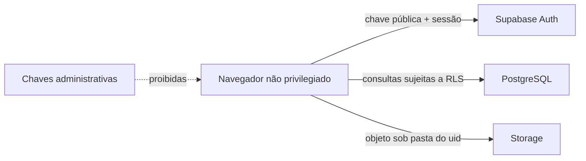

# Segurança e privacidade da camada Supabase Web

Este documento descreve os controles da camada Supabase usada pelo frontend integrado. Ele complementa a documentação de segurança do repositório e não substitui avaliação jurídica, política institucional ou validação antes de uso real.

## Classificação dos dados

| Classe | Exemplos | Tratamento |
| --- | --- | --- |
| Público | landing page, documentação, assets de marca | pode ser distribuído pelo frontend; |
| Conta | nome profissional, e-mail, preferências, foto de perfil | acesso do titular; evite exposição desnecessária; |
| Clínico sensível | paciente, contato, avaliação, imagem, ROI, agenda, assinatura e notas | autenticação, RLS, mínimo acesso e evidência sanitizada; |
| Segredo | `service_role`, senha de banco, token privado | nunca entra no frontend, Git, Issue, log ou screenshot; |

O [dicionário de dados](data-dictionary.md) aplica essas classes a cada tabela,
coluna, campo JSON e bucket persistido. A classificação deve ser revisada junto de
toda mudança de schema ou contrato.

## Fronteiras de confiança

O navegador é ambiente não confiável. Filtros no cliente melhoram a experiência, mas a autorização real pertence às políticas do banco e do Storage.

## Fronteira com o produto integrado

O frontend continua enviando o token de sessão Supabase como Bearer para
`VITE_CLINICAL_API_URL`. Esse contrato não foi alterado nesta migração. Como
rotas preservadas do backend ainda podem validar tokens Firebase, logout remoto
e chamadas clínicas precisam de teste de integração antes de produção; não se
deve trocar emissor, aceitar ambos ou contornar validação sem decisão
arquitetural e testes negativos. Firebase, Heal Analyzer e integrações
REDI-SUS/FHIR/RNDS permanecem fora das migrações Supabase desta pasta.

## Autenticação e sessão

- Supabase Auth fornece a identidade e o token da sessão.
- `ProtectedRoute` não publica conteúdo clínico enquanto a sessão é validada.
- `AuthProvider` remove canais e serializa transições para evitar identidade obsoleta.
- Logout limpa rascunhos clínicos locais antes de solicitar encerramento global.
- Recuperação de senha não revela se um e-mail está cadastrado.
- Erros de login são traduzidos para mensagens genéricas.

URLs de OAuth devem ser limitadas aos domínios conhecidos de cada ambiente.
Consulte [environments.md](environments.md) para a separação obrigatória de
projetos Supabase, chaves públicas, OAuth apps e Redirect URLs entre
desenvolvimento, homologação e produção.

## Autorização no banco

As tabelas `users`, `patients`, `evaluations` e `appointments` têm RLS habilitada. A regra básica exige `auth.uid() = user_id` ou `auth.uid() = uid`.

Avaliações e compromissos verificam também se o paciente relacionado pertence ao usuário atual. O frontend repete filtros por proprietário, mas eles não substituem RLS.

A migração de reparo [`202608040002_repair_clinical_rls_policies.sql`](../supabase/migrations/202608040002_repair_clinical_rls_policies.sql) restaura essas políticas pessoais quando um ambiente implantado diverge do repositório. Ela não implementa vínculos institucionais; esses continuam sob o contrato integrado de autorização. Um erro 403 não deve ser contornado desativando RLS ou ampliando acesso de `anon`; aplique a migração e renove a sessão autenticada.

Ao criar uma tabela clínica:

1. inclua proprietário e relacionamentos;
2. habilite RLS;
3. crie políticas para as operações necessárias;
4. adicione índices para os filtros de autorização;
5. teste com dois usuários;
6. atualize `docs/data-dictionary.json` e execute `npm run docs:data:refresh`;
7. documente compatibilidade e rollback da migração.

## Imagens

`wound-images` é privado. O caminho começa com o `uid` e a política confere esse segmento. A aplicação grava no JSON da avaliação somente caminho e metadados; a URL assinada dura uma hora e é criada durante a leitura.

A migração de reparo
[`20260811005338_repair_storage_buckets_and_policies.sql`](../supabase/migrations/20260811005338_repair_storage_buckets_and_policies.sql)
remove políticas anônimas legadas, reafirma o bucket como privado e limita
leitura, criação, atualização e exclusão ao usuário autenticado cujo `uid`
ocupa o primeiro segmento do caminho.

`profile-photos` é público porque a URL faz parte do perfil visual. Não use esse bucket para fotografia clínica ou outro dado sensível.

As escritas em `profile-photos` continuam limitadas à pasta do titular. A
migração
[`20260811005855_allow_profile_photo_owner_select.sql`](../supabase/migrations/20260811005855_allow_profile_photo_owner_select.sql)
inclui a leitura autenticada exigida pelo `upsert`, sem permitir alteração de
arquivos de outra conta.

Tipos aceitos: JPEG, PNG e WebP. O limite padrão é 10 MB por arquivo no cliente e no bucket. Antes do envio, o navegador reencoda somente os pixels com nome aleatório, removendo EXIF, GPS, miniaturas e o nome original. A preparação e o envio são sequenciais, canceláveis e não registram conteýo clínico em logs. Consulte o [ADR-0003](decisions/0003-clinical-image-preparation.md).

## Estado local e logs

- Rascunhos clínicos usam prefixo por usuário e são removidos na troca ou saída.
- Não armazene avaliações ou imagens em `localStorage` como cache permanente.
- Não registre payloads clínicos, tokens ou URLs assinadas no console.
- Mensagens exibidas ao usuário devem ser acionáveis sem repetir detalhes retornados pelo provedor.
- Telemetria futura precisa de decisão específica, minimização de dados e mecanismo de consentimento quando aplicável.

## Backup e recuperação

Backups são dados sensíveis e recebem o mesmo controle de acesso, criptografia e
retenção da origem. O backup gerenciado do PostgreSQL preserva metadados do
Storage, mas não os bytes dos objetos; banco e buckets devem ser copiados e
restaurados como um único lote verificável. Credenciais administrativas de banco
ou S3 permanecem no cofre operacional e nunca entram no frontend, Git ou
evidências públicas.

RPO/RTO, retenção, dupla revisão, restauração isolada e ensaios periódicos estão
definidos em [backup-and-recovery.md](backup-and-recovery.md). A automação do
repositório usa somente dados sintéticos e uma stack local dedicada.

## Integridade

- IDs são UUIDs gerados antes da persistência.
- Relações usam chaves estrangeiras.
- Dor é limitada a 0–10.
- Status de compromisso usa conjunto fechado.
- Timestamps de atualização são mantidos por trigger e pelo cliente.
- Eventos Realtime provocam nova consulta autorizada em vez de confiar no conteúdo do evento.

## LGPD e ciclo de vida

Esta camada aplica necessidade, segurança e controle de acesso. Retenção,
exportação, eliminação de conta e auditoria precisam permanecer alinhadas às
políticas integradas antes de operação institucional.

Ambientes de desenvolvimento, homologação, demonstração e preview devem usar
apenas dados sintéticos. Dados reais autorizados pertencem somente à produção e
não devem ser copiados para ambientes inferiores.

## Checklist antes de produção

- [ ] migração aplicada e versionada;
- [ ] RLS habilitada em todas as tabelas clínicas;
- [ ] teste cruzado entre dois usuários aprovado;
- [ ] `wound-images` confirmado como privado;
- [ ] chave `service_role` ausente do bundle e do host;
- [ ] Redirect URLs restritas;
- [ ] produção usa Supabase, chaves, OAuth app e domínio separados de desenvolvimento e homologação;
- [ ] HTTPS obrigatório;
- [ ] política de [backup e recuperação](backup-and-recovery.md) aplicada, com lote recente e ensaio aprovado;
- [ ] processo de incidentes e responsável estabelecidos;
- [ ] dados sintéticos removidos do ambiente;
- [ ] logs e ferramentas externas revisados quanto a dados pessoais.

## Vulnerabilidades e incidentes

Relatos seguem [SECURITY.md](../../../../SECURITY.md). Em suspeita de exposição:

1. preserve evidências sem copiar dados clínicos desnecessariamente;
2. revogue chaves ou sessões comprometidas;
3. restrinja o acesso afetado;
4. identifique escopo e período;
5. corrija a causa e acrescente teste de regressão;
6. siga as obrigações legais e operacionais aplicáveis.
