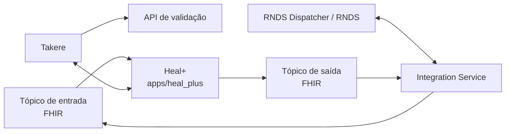

# Fronteira do Heal+ no cluster Takere

## Objetivo

Organizar o repositório para representar somente o módulo Heal+ dentro da
arquitetura fornecida. RNDS Dispatcher, DB Integration, Integration Service,
tópicos, Takere, API de validação, Dermasus, Rede Viva e Twin são dependências
externas; eles não são implementados ou simulados aqui.

## Recorte do diagrama

As setas representam responsabilidades lógicas. Endpoint, broker, nomes de
tópicos, certificados e autenticação ainda dependem do contrato oficial do
cluster.

## Responsabilidade do Heal+

O Heal+:

1. mantém a experiência web e a API do acompanhamento de feridas;
2. produz e consome recursos FHIR R4 apenas através da fronteira de integração;
3. disponibiliza somente uma referência mínima de imagem quando uma operação do
   Takere estiver autorizada;
4. diferencia validação técnica de imagem, inferência assistiva e revisão
   clínica humana;
5. falha fechado quando autenticação, autorização, consentimento ou destino não
   estiverem comprovados.

O Heal+ não:

- gerencia certificado digital da RNDS;
- acessa diretamente `/api/fhir/r4/bundle` da RNDS;
- implementa worker RNDS, banco de integração ou broker;
- conhece dados internos de Dermasus, Rede Viva ou Twin;
- envia imagem ou bundle automaticamente após upload, análise ou salvamento;
- trata uma validação técnica ou saída de IA como diagnóstico.

## Estado atual e estado-alvo

| Capacidade | Estado atual | Estado-alvo |
|---|---|---|
| Aplicação Heal+ | backend e frontend em `apps/heal_plus/` | deploy independente do módulo |
| FHIR R4 | mapeamento, validação e exportação local | adaptador assíncrono após contrato do cluster |
| Publicação externa | serviço controlado e adaptador RNDS isolado, sem ativação/homologação real | Integration Service como único destino aprovado |
| Tópicos | não implementados | adaptadores com idempotência, retry limitado e DLQ protegida |
| Imagens/Takere | pipeline interno do Heal+ | referência mínima e autorização escopada |
| RNDS | adaptador Python disponível fora de `apps/heal_plus/`, não ativado | somente via Integration Service e RNDS Dispatcher |

## Regras de segurança

- FHIR e imagens são dados pessoais sensíveis.
- Payloads clínicos não entram em logs, URLs, analytics ou mensagens de erro.
- Eventos usam identificadores técnicos e não identificadores de paciente.
- Publicação exige ação explícita, finalidade, consentimento, autorização do
  caso, destino aprovado e idempotência.
- Retry não pode trocar silenciosamente de destino nem duplicar publicação.
- Acesso a imagem exige autorização do usuário e do caso; uma referência não
  concede acesso por si só.
- Toda saída automatizada continua sujeita a revisão profissional antes do
  registro clínico.

## Contratos versionados

Os envelopes lógicos ficam em `contracts/heal_plus/`. Eles documentam o limite
do Heal+ sem escolher infraestrutura que ainda não foi formalizada.
